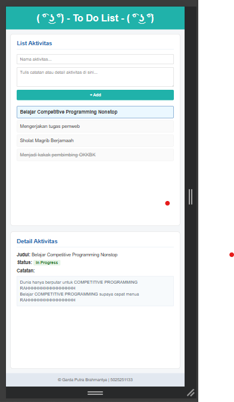

# 5025251133_Todo-App

## Identitas
- Nama: Garda Putra Brahmantya
- NRP: 5025251133
- Kelas: Pemrograman Web - A


## Deskripsi

### 1. Semantic HTML Elements

Menggunakan beberapa elemen semantic HTML5 seperti `<header>`, `<main>`, `<aside>`, dan `<footer>` untuk membagi struktur halaman.

1. `<header>` saya gunakan sebagai tempat judul utama `<h1>`  
    kutipan kode:

   ```html
   <header>
    <h1> ( ͡° ͜ʖ ͡°) - To Do List - ( ͡° ͜ʖ ͡°) </h1>
   </header>
   ```

2. `<main>` saya gunakan sebagai tempat untuk panel kiri  
    kutipan kode:
   ```html
   <main class="container">
    
    <section class="panelLeft">
      <h2>List Aktivitas</h2>

      <form class="form-todo">
        <input 
          type="text" 
          placeholder="Nama aktivitas..." 
          required
        >
        <textarea 
          placeholder="Tulis catatan atau detail aktivitas di sini..." 
          rows="3"
        ></textarea>
        <button type="submit">+ Add</button>
      </form>

      <ul class="list-aktivitas">
        <li class="item selected">Belajar Competitive Programming Nonstop</li>
        <li class="item">Mengerjakan tugas pemweb</li>
        <li class="item">Sholat Magrib Berjamaah</li>
        <li class="item completed">Menjadi kakak pembimbing OKKBK</li>
      </ul>
    </section>

    <aside class="panelRight">
      <h2>Detail Aktivitas</h2>
      <div class="isi-detail">
        <p><strong>Judul:</strong> Belajar Competitive Programming Nonstop</p>
        <p class="statusParagraph"><strong>Status:</strong> <span class="status-in-progress">In Progress</span></p>
        <p><strong>Catatan:</strong></p>
        <div class="kotak-catatan">
          Dunia hanya berputar untuk COMPETITIVE PROGRAMMING RAHHHHHHHHHHHHHHHH
          <br>Belajar COMPETITIVE PROGRAMMING supaya cepat menua RAHHHHHHHHHHHHHHHH
        </div>
      </div>
    </aside>
   </main>
   ```
3. `<section>` digunakan untuk panel kiri yang memuat form pembuatan tugas serta daftar aktivitas.
    kutipan kode:
   ```html
   <section class="panelLeft">
      <h2>List Aktivitas</h2>

      <form class="form-todo">
        <input 
          type="text" 
          placeholder="Nama aktivitas..." 
          required
        >
        <textarea 
          placeholder="Tulis catatan atau detail aktivitas di sini..." 
          rows="3"
        ></textarea>
        <button type="submit">+ Add</button>
      </form>

      <ul class="list-aktivitas">
        <li class="item selected">Belajar Competitive Programming Nonstop</li>
        <li class="item">Mengerjakan tugas pemweb</li>
        <li class="item">Sholat Magrib Berjamaah</li>
        <li class="item completed">Menjadi kakak pembimbing OKKBK</li>
      </ul>
    </section>
   ```

5. `<aside>` saya gunakan sebagai tempat untuk panel kanan  
    kutipan kode:
   ```html
   <aside class="panelRight">
      <h2>Detail Aktivitas</h2>
      <div class="isi-detail">
        <p><strong>Judul:</strong> Belajar Competitive Programming Nonstop</p>
        <p class="statusParagraph"><strong>Status:</strong> <span class="status-in-progress">In Progress</span></p>
        <p><strong>Catatan:</strong></p>
        <div class="kotak-catatan">
          Dunia hanya berputar untuk COMPETITIVE PROGRAMMING RAHHHHHHHHHHHHHHHH
          <br>Belajar COMPETITIVE PROGRAMMING supaya cepat menua RAHHHHHHHHHHHHHHHH
        </div>
      </div>
    </aside>
   ```
6. `<footer>` saya gunakan sebagai tempat identitas, seperti nama nrp
   kutipan kode:
   ```html
   <footer>
    <p>&copy; Garda Putra Brahmantya | 5025251133 </p>
   </footer>
   ```

### 2. Layout 2 Panel

Tata letak dua panel diatur menggunakan CSS Flexbox pada elemen kontainer utama: <br>
+ Panel Kiri (.panelLeft): memuat form penambahan aktivitas dan daftar to-do. <br>
+ Panel Kanan (.panelRight): memuat informasi detail mengenai aktivitas yang sedang dipilih. <br>

Kedua panel diberikan proporsi lebar yang seimbang (flex: 1) dan dipisahkan dengan gap:

```css
.container {
  display: flex;
  gap: 20px;
  padding: 20px;
  max-width: 900px;
  margin: 0 auto;
  flex: 1;
  width: 100%;
}

.panelLeft,
.panelRight {
  background-color: #ffffff;
  border: 1px solid #ddd;
  border-radius: 8px;
  padding: 20px;
  flex: 1;
}
```

### 3. Form Input

Panel kiri dilengkapi form terpisah untuk memasukkan judul sekaligus catatan/detail aktivitas baru secara terstruktur: <br>
+ Input Teks: untuk memasukkan nama aktivitas.
+ Textarea: untuk menambahkan catatan atau rincian kegiatan.
+ Tombol Submit: tombol aksi penambahan tugas.

```html
  <form class="form-todo">
    <input 
      type="text" 
      placeholder="Nama aktivitas..." 
      required
    <textarea 
      placeholder="Tulis catatan atau detail aktivitas di sini..." 
      rows="3"
    ></textarea>
    <button type="submit">+ Add</button>
  </form>
```

Form diatur menggunakan orientasi vertikal pada CSS agar nyaman digunakan:
```css
.form-todo {
  display: flex;
  flex-direction: column;
  gap: 10px;
  margin-bottom: 20px;
}
```
### 4. Data Statis

Daftar aktivitas disajikan menggunakan data dummy statis dengan penanda status aktivitas (seperti status aktif dan status selesai):

```html
<ul class="list-aktivitas">
  <li class="item selected">Belajar Competitive Programming Nonstop</li>
  <li class="item">Mengerjakan tugas pemweb</li>
  <li class="item">Sholat Magrib Berjamaah</li>
  <li class="item completed">Menjadi kakak pembimbing OKKBK</li>
</ul>
```

Panel kanan menampilkan detail lengkap item yang sedang dipilih, termasuk penanda status bergradasi hijau dan kotak deskripsi:
```html
<div class="isi-detail">
  <p><strong>Judul:</strong> Belajar Competitive Programming Nonstop</p>
  <p class="statusParagraph"><strong>Status:</strong> <span class="status-in-progress">In Progress</span></p>
  <p><strong>Catatan:</strong></p>
  <div class="kotak-catatan">
    Dunia hanya berputar untuk COMPETITIVE PROGRAMMING RAHHHHHHHHHHHHHHHH
    <br>Belajar COMPETITIVE PROGRAMMING supaya cepat menua RAHHHHHHHHHHHHHHHH
  </div>
</div>
```

### 5. Responsive Design Tampilan dibuat responsive menggunakan `@media`
Halaman di-design responsif menggunakan Media Query dengan breakpoint 640px. Ketika diakses melalui perangkat mobile atau layar sempit, tata letak otomatis berubah dari format dua kolom menjadi satu kolom vertikal.
```css
@media (max-width: 640px) {
  .container {
    flex-direction: column;
    padding: 15px;
  }
}
```
- Saat di buka di mobile tampilan panel akan menjadi atas bawah. kemudian panel kanan di tampilkan di atas panel kiri dengan mengubah urutannya menggunakan properti `order`.

### 6. External CSS
Seluruh aturan style dipisahkan sepenuhnya ke dalam file external style.css dan dihubungkan pada bagian `<head>` file index.html:
```html
<link rel="stylesheet" href="style.css">
```

## Preview 
- Tampilan Biasa <br>
  

- Tampilan Mobile <br>
  
  
Maturnuwun, Terima Kasih, Gracias, Syukron, Arigatou Ozaimasu, Thank you
