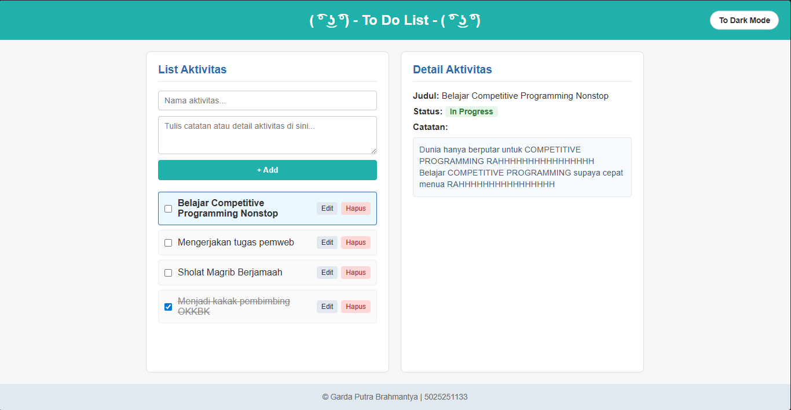
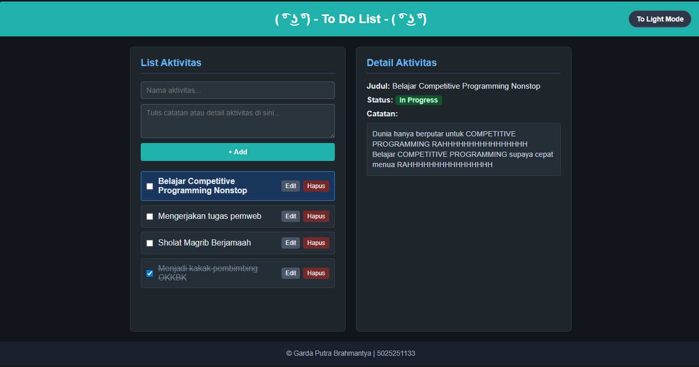
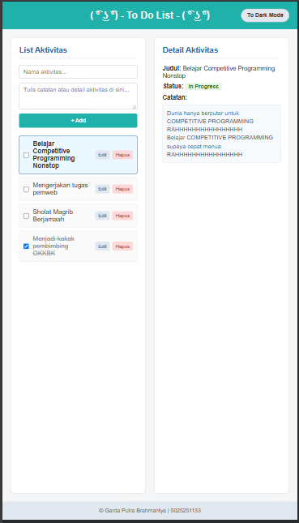

# 5025251133_Todo-App

## Identitas
- Nama: Garda Putra Brahmantya
- NRP: 5025251133
- Kelas: Pemrograman Web - A

---

## Deskripsi Pembaruan Proyek

Aplikasi **Todo List** ini telah diperbarui dari interface statis menjadi dinamis yang interaktif dengan JavaScript (DOM Manipulation), sistem manajemen *state* berbasis *array of objects*, fitur pengeditan langsung (*inline editing*), penandaan status tugas selesai, penghapusan tugas, serta pergantian theme *Dark Mode* / *Light Mode*.

---

### 1. Semantic HTML Elements

Halaman dibangun menggunakan elemen semantik standar HTML5:

1. `<header>` memuat judul utama halaman dan tombol pergantian tema visual.
   ```html
   <header>
     <div class="header-content">
       <h1> ( ͡° ͜ʖ ͡°) - To Do List - ( ͡° ͜ʖ ͡°) </h1>
       <button id="themeToggleBtn" type="button" class="btn-theme">To Dark Mode</button>
     </div>
   </header>
   ```

2. `<main class="container">` mem-wrap/membungkus tata letak utama dua panel aplikasi.

3. `<section class="panelLeft">` menjadi wadah form input aktivitas baru serta daftar to-do yang dirender secara dinamis.
   ```html
   <section class="panelLeft">
     <h2>List Aktivitas</h2>

     <form id="todoForm" class="form-todo">
       <input type="text" id="todoInputTitle" placeholder="Nama aktivitas..." required>
       <textarea id="todoInputDesc" placeholder="Tulis catatan atau detail aktivitas di sini..." rows="3"></textarea>
       <button type="submit">+ Add</button>
     </form>

     <ul id="todoList" class="list-aktivitas"></ul>
   </section>
   ```

4. `<aside class="panelRight">` memuat dua tampilan yakni tampilan detail teks biasa (`#viewMode`) dan form pengeditan aktivitas (`#editForm`)
   ```html
   <aside class="panelRight">
     <h2>Detail Aktivitas</h2>

     <div id="viewMode" class="isi-detail">
       <p><strong>Judul:</strong> <span id="detailTitle">-</span></p>
       <p class="statusParagraph"><strong>Status:</strong> <span id="detailStatus">-</span></p>
       <p><strong>Catatan:</strong></p>
       <div id="detailDesc" class="kotak-catatan">-</div>
     </div>

     <form id="editForm" class="form-edit" style="display: none;">
       <div class="edit-group">
         <label for="editTitle"><strong>Judul:</strong></label>
         <input type="text" id="editTitle" required>
       </div>
       <div class="edit-group">
         <label for="editStatus"><strong>Status:</strong></label>
         <select id="editStatus">
           <option value="false">In Progress</option>
           <option value="true">Completed</option>
         </select>
       </div>
       <div class="edit-group">
         <label for="editDesc"><strong>Catatan:</strong></label>
         <textarea id="editDesc" rows="4"></textarea>
       </div>
       <div class="edit-actions">
         <button type="submit" class="btn-save">Simpan Perubahan</button>
         <button type="button" id="btnCancelEdit" class="btn-cancel">Batal</button>
       </div>
     </form>
   </aside>
   ```

5. `<footer>` menampilkan identitas pengembang aplikasi.
   ```html
   <footer>
     <p>&copy; Garda Putra Brahmantya | 5025251133 </p>
   </footer>
   ```

---

### 2. Layout Dua Panel (Flexbox)

Kedua panel diletakkan berdampingan dengan ukuran yang seimbang menggunakan CSS Flexbox:
- **Panel Kiri (`.panelLeft`):** Memuat form penambahan aktivitas dan daftar to-do.
- **Panel Kanan (`.panelRight`):** Memuat informasi detail aktivitas terpilih atau formulir pengeditan data.

```css
.container {
  display: flex;
  gap: 20px;
  padding: 20px;
  max-width: 900px;
  margin: 0 auto;
  flex: 1;
  width: 100%;
}

.panelLeft,
.panelRight {
  background-color: #ffffff;
  border: 1px solid #ddd;
  border-radius: 8px;
  padding: 20px;
  flex: 1;
}
```

---

### 3. Struktur Data yang Object Oriented

Data aktivitas disimpan sebagai kumpulan objek di dalam variabel JavaScript. Data tidak disimpan ke local storage, sehingga ketika halaman di-refresh, seluruh status dan daftar aktivitas akan kembali ke kondisi awal.

```javascript
const defaultTodos = [
  {
    id: 1,
    title: "Belajar Competitive Programming Nonstop",
    desc: "Dunia hanya berputar untuk COMPETITIVE PROGRAMMING RAHHHHHHHHHHHHHHHH\nBelajar COMPETITIVE PROGRAMMING supaya cepat menua RAHHHHHHHHHHHHHHHH",
    completed: false
  },
  {
    id: 2,
    title: "Mengerjakan tugas pemweb",
    desc: "Membuat manipulasi DOM interaktif dan fitur dark mode.",
    completed: false
  },
  {
    id: 3,
    title: "Sholat Magrib Berjamaah",
    desc: "Berangkat ke masjid tepat waktu saat adzan berkumandang.",
    completed: false
  },
  {
    id: 4,
    title: "Menjadi kakak pembimbing OKKBK",
    desc: "Membimbing mahasiswa baru departemen.",
    completed: true
  }
];

let todos = [...defaultTodos];
let selectedTodoId = 1;
let editingTodoId = null;
```

---

### 4. Manipulasi DOM & Pembuatan Todo Baru Tanpa Refresh

Formulir penambahan aktivitas menangani *event* submit dengan mencegah *reload* halaman (`e.preventDefault()`). Data baru dimasukkan ke urutan teratas array objek (`todos.unshift()`), lalu interface daftar dirender ulang seketika.

```javascript
todoForm.addEventListener("submit", (e) => {
  e.preventDefault();

  const titleValue = todoInputTitle.value.trim();
  const descValue = todoInputDesc.value.trim();

  if (!titleValue) return;

  const newTodo = {
    id: Date.now(),
    title: titleValue,
    desc: descValue,
    completed: false
  };

  todos.unshift(newTodo);
  selectedTodoId = newTodo.id;

  todoForm.reset();
  closeEditMode();
});
```

---

### 5. Checkbox, Edit Data, dan Hapus Data yang Interaktif

Setiap elemen daftar todo (`<li>`) dibuat secara dinamis menggunakan JavaScript dengan fungsi-fungsi interaktif:

1. **Checkbox Status Selesai:**
   - Menggunakan `e.stopPropagation()` pada event klik agar tidak memicu pemilihan baris.
   - Mencentang checkbox mengubah nilai `completed` menjadi `true`, memberikan efek coret teks (`.completed`), dan memperbarui status pada panel kanan menjadi **Completed**.
   - Membatalkan centang mengembalikan status menjadi **In Progress**.

2. **Tombol Edit (Inline Mode):**
   - Menekan tombol **Edit** tidak menampilkan dialog sembulan browser, melainkan membuka form input di panel kanan secara langsung.
   - Pengguna dapat mengubah nama aktivitas, deskripsi/catatan, serta status penyelesaian tugas.

3. **Tombol Hapus:**
   - Menghapus objek tugas dari array `todos` melalui fungsi filter berdasarkan ID.
   - Jika item yang sedang aktif dihapus, seleksi otomatis beralih ke item pertama yang tersedia.

```javascript
checkbox.addEventListener("click", (e) => {
  e.stopPropagation();
});

checkbox.addEventListener("change", () => {
  todo.completed = checkbox.checked;
  selectedTodoId = todo.id;

  if (editingTodoId === todo.id) {
    editStatus.value = todo.completed ? "true" : "false";
  }

  renderTodos();
  renderDetail();
});
```

---

### 6. Fitur Dark Mode / Light Mode

Peralihan tema dilakukan dengan memanipulasi kelas `dark-mode` pada elemen `<body>`. Bagian latar belakang header tetap mempertahankan warna aksen aslinya, sementara warna panel, teks, formulir, dan tombol disesuaikan untuk kenyamanan visual. Efek kursor sentuh (`:hover`) juga telah disediakan khusus untuk mode gelap.

```javascript
themeToggleBtn.addEventListener("click", () => {
  document.body.classList.toggle("dark-mode");
  const isDarkMode = document.body.classList.contains("dark-mode");
  themeToggleBtn.textContent = isDarkMode ? "To Light Mode" : "To Dark Mode";
});
```

```css
body.dark-mode {
  background-color: #12161a;
  color: #e2e8f0;
}

body.dark-mode .panelLeft,
body.dark-mode .panelRight {
  background-color: #1e252b;
  border-color: #2d3748;
}

body.dark-mode .btn-edit:hover {
  background-color: #718096;
}

body.dark-mode .btn-delete:hover {
  background-color: #9b2c2c;
}
```

---

### 7. Responsive Design

Tampilan tetap adaptif pada berbagai ukuran layar dengan *breakpoint* 640px. Pada layar ponsel, dua panel tata letak beralih menjadi satu kolom vertikal yang tertata ke bawah.

```css
@media (max-width: 640px) {
  header {
    padding: 15px 10px;
  }

  .header-content {
    flex-direction: column;
    gap: 12px;
  }

  .btn-theme {
    position: static;
    transform: none;
  }

  .container {
    flex-direction: column;
    padding: 15px;
  }
}
```

---

### 8. File Structure

Proyek terdiri dari tiga berkas utama yang terpisah secara sendiri-sendiri yakni:
- `index.html` untuk struktur elemen semantik halaman interface.
- `style.css` untuk tata letak visual, aturan responsif, serta palet tema terang dan gelap.
- `script.js` untuk manipulasi DOM, manajemen data objek, event listener, dan interaktivitas komponen.

---

## Preview Tampilan

- **Tampilan Desktop (Light Mode)**  
  

- **Tampilan Desktop (Dark Mode)**  
  

- **Tampilan Mobile**  
  
